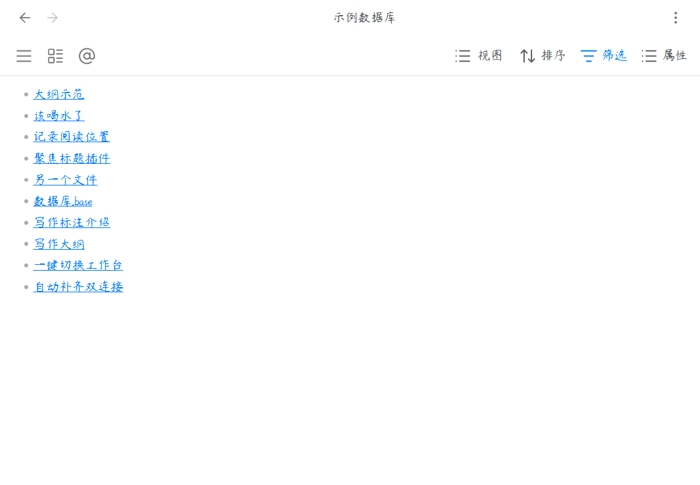

# ✦ Base 视图切换器 ✦

我在小红书发布了许多obsidian的教程和插件开发进度，你的关注就是对我最大的支持

一键切换数据库视图，告别繁琐操作，让数据管理更高效。

  

[简体中文](#简体中文) | [用法](#用法) | [English](#english) | [Usage](#usage)

---

## 简体中文

### 核心功能

#### 1. 快速视图切换
为 Base 数据库添加自定义按钮，点击即可瞬间切换到指定视图，无需手动选择。

#### 2. 界面美化定制
自由控制工具栏元素显隐，隐藏不需要的按钮和计数，让界面更简洁清爽。

#### 3. 灵活按钮配置
支持默认按钮和自定义按钮，可选择图标模式或文字模式，满足不同使用习惯。

#### 4. 拖拽排序
按钮顺序支持拖拽调整，按照你的使用频率自由排列。

#### 5. 多数据库管理
支持为不同的 Base 文件配置独立的按钮方案，每个数据库都有专属设置。

***

## 用法

### 安装后配置

1. 安装插件后，打开 **设置** > **Base 视图切换器**。
2. 点击 **"+ 添加数据库"** 按钮，选择需要配置的 `.base` 文件。
3. 配置完成后，打开该 Base 文件即可看到工具栏上的切换按钮。

### 配置界面美化

在设置页面的 **"界面美化"** 区域，你可以：

| 选项 | 说明 |
|------|------|
| 启用自定义视图菜单样式 | 解决小尺寸面板下按钮挤压问题 |
| 隐藏 "X 个结果" | 隐藏工具栏上的结果计数 |
| 隐藏 "搜索" 按钮 | 隐藏搜索功能按钮 |
| 隐藏 "属性" 按钮 | 隐藏属性筛选按钮 |
| 隐藏 "筛选" 按钮 | 隐藏筛选功能按钮 |
| 隐藏 "排序" 按钮 | 隐藏排序功能按钮 |

### 配置默认按钮

默认按钮使用固定的 **home** 图标，适合绑定主视图：

1. 开启 **"启用默认按钮"** 开关。
2. 选择按钮位置：**靠左（排在第一）** 或 **靠右（排在最后）**。
3. 点击 **"选择视图"** 按钮，从弹出列表中选择要绑定的视图。

### 配置自定义按钮

自定义按钮可绑定任意视图，支持图标模式和文字模式：

1. 点击 **"+ 添加"** 按钮创建新按钮。
2. **更改图标**：点击图标按钮，从弹出的图标库中搜索选择。
3. **绑定视图**：点击视图名称按钮，从当前数据库的视图列表中选择。
4. **切换显示模式**：
   - 眼睛图标（睁眼）：图标模式，只显示图标，节省空间
   - 眼睛图标（闭眼）：文字模式，显示视图名称，适合宽屏
5. **删除按钮**：点击垃圾桶图标移除按钮。
6. **调整顺序**：拖拽按钮左侧的 grip 图标调整位置。

### 删除配置

如需删除某个数据库的配置：
1. 在设置页面切换到对应的数据库标签页。
2. 滚动到底部，找到 **"危险操作"** 区域。
3. 点击 **"删除此配置"** 按钮并确认。

***

### 赞赏支持

🎁 如果觉得有用，请作者喝杯咖啡

 

  

***

### 安装方法

#### 方法一：社区插件安装（推荐）

待插件通过审核并上架社区市场后：
1. 打开 Obsidian **设置** > **社区插件** > **浏览**。
2. 搜索并选择 `Base View Switcher`。
3. 点击 **安装** 并选择 **启用**。

#### 方法二：手动安装

1. 前往 [Releases](https://github.com/your-repo/releases) 页面下载最新的 `main.js` 和 `manifest.json` 文件。
2. 打开您的 Obsidian 库所在的本地文件夹。
3. 进入 `.obsidian/plugins/` 目录，并创建一个名为 `base-view-switcher` 的文件夹。
4. 将下载的两个文件放入该文件夹中。
5. 在 Obsidian **设置** > **社区插件** 中重新加载并开启该插件。

***

QQ 交流群：1094620986

---

## English

**Base View Switcher** — A powerful view switching plugin for Obsidian's Base database. Add custom buttons to quickly switch between different views, with full control over toolbar elements and button layout.

*** 

### Features

#### 1. Quick View Switching
Add custom buttons to Base database files for instant view switching without manual selection.

#### 2. UI Customization
Freely control toolbar elements visibility, hide unnecessary buttons and counts for a cleaner interface.

#### 3. Flexible Button Configuration
Support default and custom buttons, choose between icon mode or text mode to suit different preferences.

#### 4. Drag & Drop Sorting
Button order supports drag-and-drop adjustment, arrange by your usage frequency.

#### 5. Multi-Database Management
Configure independent button schemes for different Base files, each database has its own settings.

***

## Usage

### After Installation

1. After installing the plugin, open **Settings** > **Base View Switcher**.
2. Click the **"+ Add Database"** button to select a `.base` file to configure.
3. Once configured, open the Base file to see the switching buttons in the toolbar.

### Interface Customization

In the **"Interface Customization"** section of settings:

| Option | Description |
|--------|-------------|
| Enable custom view menu style | Fix button squeezing in small panels |
| Hide "X results" | Hide result count in toolbar |
| Hide "Search" button | Hide search functionality button |
| Hide "Properties" button | Hide properties filter button |
| Hide "Filter" button | Hide filter functionality button |
| Hide "Sort" button | Hide sort functionality button |

### Default Button Configuration

Default button uses a fixed **home** icon, suitable for binding to the main view:

1. Enable the **"Enable default button"** toggle.
2. Choose button position: **Left (first)** or **Right (last)**.
3. Click **"Select view"** button to choose from the view list.

### Custom Button Configuration

Custom buttons can bind any view, supporting icon mode and text mode:

1. Click **"+ Add"** button to create a new button.
2. **Change icon**: Click the icon button to search and select from the icon library.
3. **Bind view**: Click the view name button to select from current database's view list.
4. **Toggle display mode**:
   - Eye icon (open): Icon mode, shows only icon, saves space
   - Eye icon (closed): Text mode, shows view name, suitable for widescreen
5. **Delete button**: Click the trash icon to remove the button.
6. **Reorder**: Drag the grip icon on the left side of the button to adjust position.

### Delete Configuration

To delete a database configuration:
1. Switch to the corresponding database tab in settings.
2. Scroll to the bottom, find the **"Dangerous Operations"** section.
3. Click **"Delete this configuration"** button and confirm.

***

### Installation

#### Method 1: Community Plugins (Recommended)

Once the plugin is reviewed and listed on the community marketplace:
1. Open Obsidian **Settings** > **Community plugins** > **Browse**.
2. Search for and select `Base View Switcher`.
3. Click **Install** and then **Enable**.

#### Method 2: Manual Installation

1. Go to the [Releases](https://github.com/your-repo/releases) page to download the latest `main.js` and `manifest.json` files.
2. Open your Obsidian vault folder on your computer.
3. Navigate to the `.obsidian/plugins/` directory and create a folder named `base-view-switcher`.
4. Place the downloaded files into this folder.
5. Reload and enable the plugin in Obsidian **Settings** > **Community plugins**.

***

QQ Group: 1094620986
